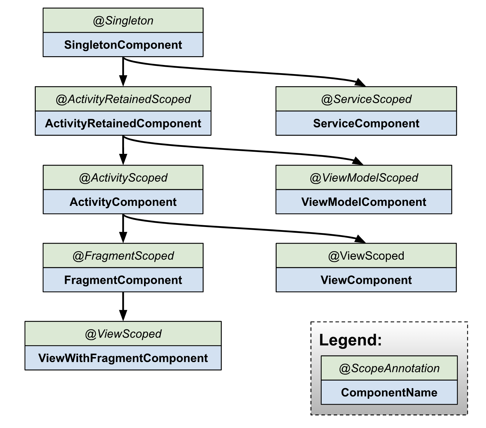

# Custom component, scope 테스트 

hilt custom component, scope를 구현하고 테스트합니다.

사용자가 명시적으로 생성/해제할 수 있는 컴포넌트를 생성하여 안드로이드 컴포넌트 생명주기와는 별도로 관리되는 생명주기를 테스트합니다.

## custom component?

힐트에서 제공하는 컴포넌트들의 생명주기는 안드로이드 컴포넌트의 생명주기를 따릅니다.

커스텀 컴포넌트를 통해 임의의 수명 주기의 컴포넌트 관리가 가능합니다.

(사용자의 로그인-로그아웃 주기에 맞춘 컴포넌트, 특정 네비게이션 플로우와 생명주기를 공유하는 컴포넌트 등)

## 구성

[CustomComponent](https://github.com/EHK00/HiltComponentStudy/blob/main/customScopeTest/src/main/java/com/example/customscopetest/CustomComponent.kt)

SingletonComponent를 상속한 customComponent입니다.

[CustomScope](https://github.com/EHK00/HiltComponentStudy/blob/main/customScopeTest/src/main/java/com/example/customscopetest/CustomScope.kt)

customComponent 생명주기에 매핑된 scope입니다.

[CustomComponentManager](https://github.com/EHK00/HiltComponentStudy/blob/main/customScopeTest/src/main/java/com/example/customscopetest/model/CustomComponentManager.kt)

customComponent를 생성하고 EntryPoint로부터 CheckModelHolder를 가져옵니다.

EntryPoint?

Dagger를 사용하여 종속성을 주입할 수 없는 코드에서 Dagger 제공 개체를 가져올 수 있는 진입점입니다.

## 테스트
NEWINSTANCE 버튼을 눌러 checkModelHolder, checkModel hashcode를 확인하고

백 버튼으로 액티비티 제거 및 재생성하여 hashcode가 동일한지 확인합니다.

NEWINSTANCE 버튼을 눌러 checkModelHolder, checkModel hashcode를 확인하고

GO TO SECONDACTIVITY, RELEASE, GO TO FIRSTACTIVITY 를 눌러 새 객체가 할당되는지 확인합니다.

## 해설
### 코드 해설
CustomComponentManager는 CustomComponent를 생성하는 매니저 클래스입니다. SingletonScope로 제공하여 모든 범위에서 동일한 객체를 참조할 수 있습니다.

CustomComponent인스턴스는 CustomComponentManager.setup()으로 생성, CustomComponentManager.release()로 해제합니다.

코드 내에서 setup(), release() 호출을 통해 custom component에 명시적인 생명 주기를 부여합니다.

customScope를 통해 CheckModelHolder 바인딩 요청에 동일 객체를 참조하게합니다.
해당 내용은
[Hilt component vs scope](https://github.com/EHK00/HiltComponentStudy/tree/main/scopeTest) 
모듈 내용 참고

### 기타 회고 
Hilt 문서에서 나와있지만 custom component가 필요한지 고려해야합니다.

custom component는 구조를 더욱 복잡하게 만드며, 대부분의 경우 hilt component로도 충분히 대체됩니다.

(혹은 component를 대체할 대안이 존재할 수 있습니다.)

해당 내용에 대한 상세 설명은 [링크](https://dagger.dev/hilt/custom-components)를 참고해주세요.

## 참고자료

[https://myungpyo.medium.com/hilt-custom-component-%ED%99%9C%EC%9A%A9%ED%95%98%EA%B8%B0-a0452fe2566a](https://myungpyo.medium.com/hilt-custom-component-%ED%99%9C%EC%9A%A9%ED%95%98%EA%B8%B0-a0452fe2566a)

[https://manuelvivo.dev/hilt-adding-components](https://manuelvivo.dev/hilt-adding-components)

[https://dagger.dev/hilt/custom-components](https://dagger.dev/hilt/custom-components)