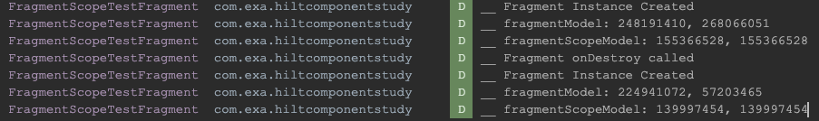
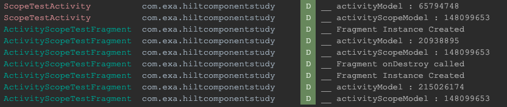
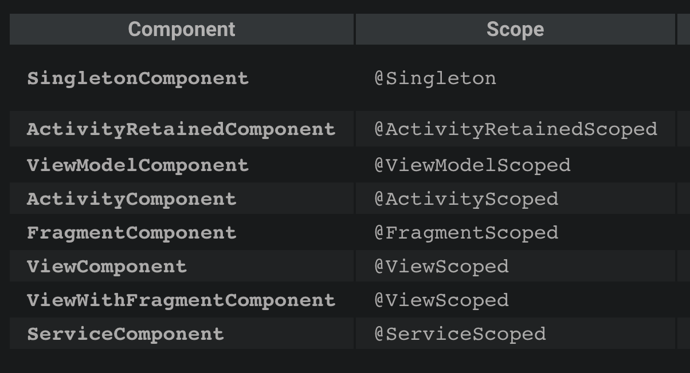

## Hilt component vs scope

Hilt Component, scope binding에 따른 인스턴스 공유 여부를 테스트합니다.

하위 범위의 안드로이드 컴포넌트에 동일한 객체를 바인딩하는지,
동일한 안드로이드 컴포넌트에서 동일한 객체를 바인딩하는지 등을 테스트합니다.

### 테스트

1)bind scope 여부에 따라 동일한 인스턴스에서 di 요청시마다 동일한 객체를 바인딩하는지 테스트합니다.

[FragmentLifeCycleModule](https://github.com/EHK00/HiltComponentStudy/blob/main/scopeTest/src/main/java/com/example/scopetest/di/FragmentLifeCycleModule.kt)
에서 unscoped bind FragmentModel, FragmentScoped bind FragmentModel 비교합니다.
FragmentScoped bind FragmentModel은 quialifier를 부여하여 구분합니다.

각 객체는 FragmentScopeTestFragment 클래스로 주입되어 onCreate 시점에 hashCode를 출력합니다.
동일 인스턴스 여부 체크를 위해 같은 타입에 대하여 fragmentModel1, fragmentModel2 식으로 바인딩을 시도합니다.

scoped bind 객체에서만 같은 객체가 바인드되면서 같은 객체를 반환하기 위해선 scoped bind를 써야함을 알 수 있습니다.

2)ActivityComponent에 설치된 모듈의 인스턴스 바인딩이 activity, fragment에 동일한 객체를 바인딩하는지 테스트합니다.

[ActivityLifeCycleModule](https://github.com/EHK00/HiltComponentStudy/blob/main/scopeTest/src/main/java/com/example/scopetest/di/ActivityLifeCycleModule.kt)
에서 unscoped bind ActivityModel, ActivityScoped bind ActivityModel을 비교합니다.
ActivityScoped bind ActivityModel은 quialifier를 부여하여 구분합니다.

각 객체는 ScopeTestActivity, ActivityScopeTestFragment 클래스로 주입되어 onCreate 시점에 hashCode를 출력합니다.

ActivityComponent에 bind가 선언되어있어도 scope를 부여하지 않으면 하위 컴포넌트에 대해서도 새 객체를 생성합니다.

## 정리
component는 객체 참고 가능 수명, scope annotation 설정 범위를 제한합니다.
(ActivityLifeCycleModule, ScopeTestActivity에서 주석 처리된 SingletonScope 바인딩의 주석을 해제하고 빌드 시 scope annotation 범위 이탈로 컴파일 에러 발생.)

dagger는 기본 동작으로 매 bind 요청마다 새로운 인스턴스를 생성합니다.(unscoped binding)
scope annotation을 통해 동일한 bind 요청의 결과로 동일한 인스턴스를 공유할 수 있습니다.

## 참고사이트
[https://dagger.dev/hilt/components](https://dagger.dev/hilt/components)

[https://dagger.dev/dev-guide/](https://dagger.dev/dev-guide/)

