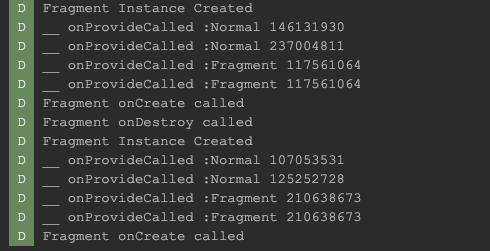
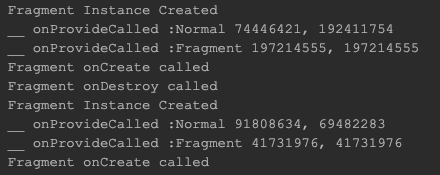
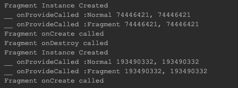
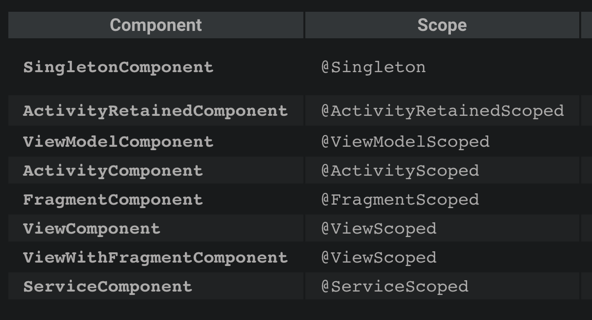

## Hilt component vs scope

Hilt Component lifetime, scope binding과 관련하여 인스턴스 테스트를 진행합니다.

### 테스트

[SingletonScopeTestFragment](https://github.com/EHK00/HiltComponentStudy/blob/main/singletonScopeTest/src/main/java/com/example/singletonscopetest/SingletonScopeTestFragment.kt)
field inject 주석 참고

#### installIn(FragmentComponent) vs @FragmentScope annotation provide function

@FragmentScope 여부에 따라서 동일 fragment에 대하여 새롭게 bind하거나, 기존 instance를 활용합니다.

#### model class define with / without @FragmentScoped annotation

[ByConstructorInjectModelImpl](https://github.com/EHK00/HiltComponentStudy/blob/main/singletonScopeTest/src/main/java/com/example/singletonscopetest/model/ByConstructorInjectModel.kt) 에서 @FragmentScoped 주석 처리 여부에 따른 차이가 발생합니다.

@FragmentScoped를 주석처리한 경우

@FragmentScoped anotation이 포함된 provider 함수 결과로 동일 컴포넌트 범위에 대해 동일 인스턴스를 참조합니다
그외에는 새로 할당합니다.

@FragmentScoped 주석을 해제한 경우

@FragmentScoped
동일 컴포넌트 범위에 대해 동일 인스턴스를 참조합니다

## 정리
component는 scope annotation 설정 범위를 제한합니다.
dagger는 기본 동작으로 매 bind 요청마다 새로운 인스턴스를 생성합니다.(unscoped binding)
scope annotation을 통해 동일한 bind 요청의 결과로 동일한 인스턴스를 공유할 수 있습니다.

## 참고사이트
[https://dagger.dev/hilt/components](https://dagger.dev/hilt/components)

[https://dagger.dev/dev-guide/](https://dagger.dev/dev-guide/)

